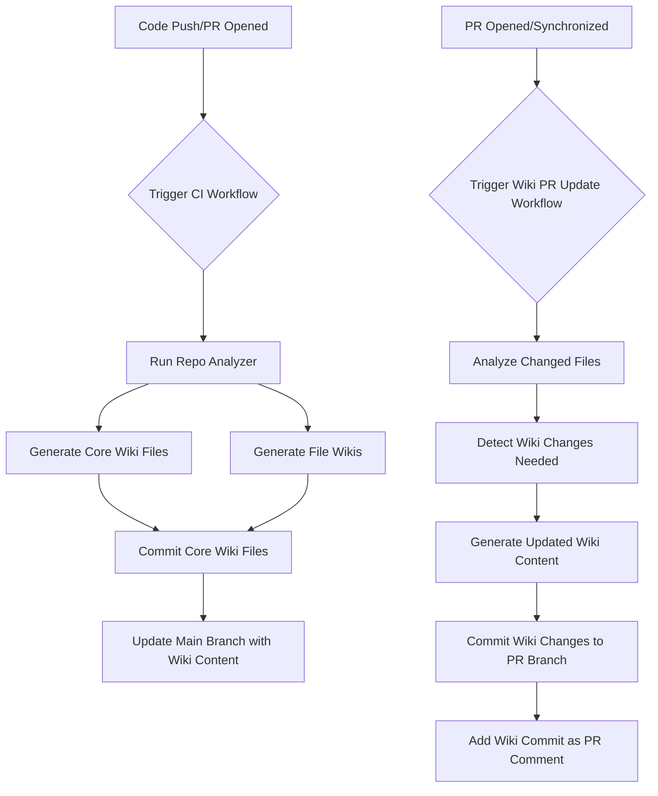

---

## CodeSentinal Wiki Update

**Reason:** The introduction of new GitHub Actions workflows and changes to the LLM integration logic necessitate an update to the 'architecture.md' file to reflect the current system design and operational flow.

## CodeSentinal Wiki Generation Workflow

## Workflow Changes

- **Wiki Initialization Workflow**: A new workflow `.github/workflows/codesentinal-wiki-init.yml` is introduced. This workflow runs on `create` events for branches and is responsible for cloning the repository, building the project, and initializing the LLM Wiki. It commits the generated wiki files back to the branch, ensuring the wiki is bootstrapped.
- **Wiki PR Update Workflow**: A new workflow `.github/workflows/codesentinal-wiki-pr-update.yml` is introduced. This workflow triggers on `pull_request` events (opened, synchronized, reopened). It analyzes the files changed in the PR, detects necessary wiki updates, generates new wiki content, and commits these changes to a new branch within the PR, providing an automated wiki update process.
- **Core Wiki Generation**: The process now utilizes LLMs (`generateFileWikiWithLLM`, `generateArchitectureWithLLM`, etc.) to create the core wiki files (`architecture.md`, `coding-rules.md`, etc.) and file-specific wikis based on repository analysis.
- **Repository Analysis**: The `repoAnalyzer.ts` module has been significantly expanded to perform comprehensive static analysis of the repository, extracting information like file types, imports, exports, symbols, purposes, risks, and tech stack, which feeds into the LLM-based wiki generation.
- **Contextual Review**: The `getWikiContextForChunks` function now plays a crucial role in retrieving relevant wiki content (core pages, file-specific pages) to provide context to the LLM during PR reviews, enhancing the accuracy and relevance of AI-generated comments.
