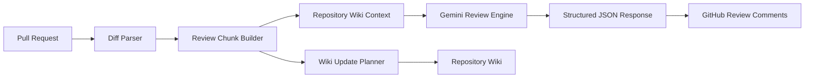
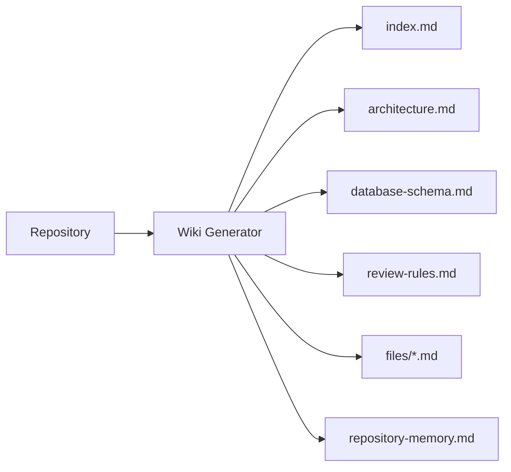

# CodeSentinal

A GitHub Action that performs repository-aware pull request reviews by combining AI-powered code review with a version-controlled project wiki that evolves alongside your codebase.

Instead of reviewing code in isolation, CodeSentinal understands architectural decisions, file responsibilities, repository-specific review rules, and long-term project knowledge before generating review comments.


## Why CodeSentinal?

Most AI code review tools analyze only the code present in a pull request. While that works for identifying generic issues, it lacks the context required to understand *why* a project is built a certain way.

Questions like these are difficult to answer from source code alone:

- Why does this service exist?
- Which files own a particular responsibility?
- What architectural decisions should new code respect?
- Are there repository-specific review rules contributors should follow?

That knowledge usually lives in documentation, pull requests, or the maintainers' heads.

CodeSentinal attempts to preserve that knowledge by maintaining a lightweight markdown wiki alongside the repository. During review, it combines the pull request diff with this repository context, allowing review comments to be based on project-specific knowledge instead of generic coding advice.

The goal is not to replace developers, but to provide reviews that better reflect how the repository is actually designed.
## What it does

CodeSentinal currently provides three core capabilities:

- Reviews pull requests and publishes inline GitHub review comments.
- Maintains a repository wiki containing architectural decisions, review rules, file responsibilities, and long-term project knowledge.
- Updates repository knowledge over time so future reviews can use accumulated project context.

Some engineering decisions built into the workflow include:

- Chunk-based pull request review instead of reviewing an entire diff at once.
- Retry and deduplication logic for GitHub and Gemini API calls.
- Separate execution paths for trusted same-repository pull requests and untrusted fork pull requests.
- Configurable review limits, context sizes, retry behaviour, and workflow parameters through a central runtime configuration.
- Structured JSON communication between the LLM and the review pipeline for deterministic parsing.
## High Level Architecture



Every pull request is first converted into smaller review chunks with surrounding context. Each chunk is then enriched using repository-specific knowledge before being reviewed by the language model.

The review pipeline produces structured JSON instead of free-form text, allowing CodeSentinal to validate responses before publishing inline GitHub review comments.


## Workflow Modes

CodeSentinal supports three execution modes, each designed for a different trust boundary and workflow.

| Mode | Trigger | Reviews PR | Updates Wiki | Intended For |
|------|---------|------------|--------------|--------------|
| Same Repository PR | `pull_request` | ✅ | ✅ | Trusted contributors |
| Fork Pull Request | `pull_request_target` | ✅ | ❌ | External contributors |
| Manual Wiki Update | `workflow_dispatch` | ❌ | ✅ | Repository maintenance |

---

### Same Repository Pull Requests

This workflow is intended for contributors who already have write access to the repository.

After reviewing the pull request, CodeSentinal may update the repository wiki if it detects new architectural knowledge, implementation details, or repository memories worth preserving.

```text
PR
 │
 ▼
Review
 │
 ▼
Wiki Update
 │
 ▼
Commit Updated Wiki
```

Since the workflow executes trusted code, it is allowed to write changes back to the repository.

---

### Fork Pull Requests

Forked pull requests execute code originating from an external repository.

To maintain a secure workflow, CodeSentinal performs **review only**.

Repository files are never modified and the wiki is not updated.

```text
Fork PR
 │
 ▼
Review
 │
 ▼
Publish Comments
 │
 ▼
Finish
```

This prevents untrusted pull requests from writing repository contents while still allowing maintainers to receive AI-assisted review comments.

---

### Manual Wiki Update

Not every architectural change arrives through a pull request.

Large refactors, migrations, documentation updates, or repository reorganizations may happen independently.

The manual workflow regenerates or updates repository knowledge without requiring a review workflow.

```text
workflow_dispatch
 │
 ▼
Analyze Repository
 │
 ▼
Update Wiki
```
## Review Pipeline

Every pull request follows the same review pipeline.


### 1. Pull Request Parsing

GitHub patches are parsed into structured hunks.

Instead of sending the complete pull request to the language model, CodeSentinal extracts only the relevant sections that require review.

---

### 2. Chunk Generation

Large pull requests are divided into smaller review chunks.

Each chunk contains:

- added lines
- removed lines
- surrounding context
- language information
- hunk metadata

Reviewing smaller chunks significantly reduces prompt size while improving review accuracy.

---

### 3. Repository Context

Before review begins, CodeSentinal loads project-specific context including:

- repository architecture
- database design
- coding guidelines
- review guidelines
- file responsibilities
- repository memory

This context is supplied alongside the code being reviewed so the language model can make repository-aware decisions instead of generic recommendations.

---

### 4. Structured Review

The model returns structured JSON rather than free-form text.

Each review contains:

- severity
- category
- affected file
- line number
- explanation
- suggested fix
- GitHub review payload

Responses are validated before being published.

---

### 5. GitHub Review

Validated comments are posted as native GitHub review comments attached directly to the modified lines.
## Repository Wiki

Most AI review tools only analyze source code.

CodeSentinal also maintains a lightweight repository wiki that evolves alongside the project.

The wiki stores long-term repository knowledge that is difficult to infer from code alone.

Examples include:

- architectural decisions
- file responsibilities
- review rules
- database design
- repository memories



During review, repository knowledge is supplied to the language model before generating comments.

This allows reviews to consider repository conventions rather than relying only on the modified code.
## Repository Memory

Certain repository knowledge should persist even after the original pull request has been merged.

Examples include:

- recurring implementation patterns
- architectural constraints
- migration notes
- review findings
- integration knowledge

Repository memories allow important project knowledge to accumulate over time instead of disappearing with individual pull requests.

Unlike source code, repository memory captures **why** something exists rather than simply **what** exists.
## Security

CodeSentinal treats trusted and untrusted pull requests differently.

- Same-repository pull requests may update repository knowledge.
- Fork pull requests are restricted to review-only mode.
- Repository files are never modified during fork workflows.
- GitHub permissions follow the principle of least privilege.
- Review comments are generated only for added lines in a pull request.
## Repository Structure

```
.
├── examples/                     # Ready-to-use GitHub workflow templates
│
├── src/
│   ├── review/                   # Pull request review pipeline
│   ├── wiki/                     # Wiki generation and repository knowledge
│   ├── github/                   # GitHub API integration
│   ├── llm/                      # Gemini communication layer
│   ├── parser/                   # Git diff parsing
│   ├── config/                   # Runtime configuration
│   └── ...
│
├── .codesentinal/
│   └── wiki/
│       ├── index.md
│       ├── architecture.md
│       ├── database-schema.md
│       ├── review-rules.md
│       ├── repository-memory.md
│       └── files/
│
└── action.yml                    # GitHub Action entrypoint
```

The project is intentionally divided into independent modules.

The review engine, wiki generation, GitHub integration, LLM communication, and configuration system are isolated from one another so that each component can evolve independently without affecting the rest of the pipeline.


# Getting Started

Getting CodeSentinal running only requires adding a workflow and providing two secrets.

## Requirements

- A GitHub repository
- GitHub Actions enabled
- A Gemini API key

---

## Step 1 — Add Repository Secrets

Navigate to

```
Settings → Secrets and Variables → Actions
```

Create the following repository secrets:

| Secret | Description |
|---------|-------------|
| `GEMINI_API_KEY` | Gemini API key used for code review |
| `GITHUB_TOKEN` | Automatically provided by GitHub Actions |

> `github.token` is automatically generated for every workflow run and does not need to be created manually.

## Step 2 — Choose a Workflow

Ready-to-use workflow templates are available in the `examples/` directory.

Choose the workflow that best matches your repository.

| Workflow | Purpose |
|-----------|---------|
| `maintainer-codesentinal-same-repo-pr-all.yml` | Reviews trusted pull requests and updates the repository wiki |
| `maintainer-codesentinal-fork-review-only.yml` | Reviews fork pull requests without modifying repository contents |
| `maintainer-codesentinal-manual-wiki-update.yml` | Regenerates repository knowledge manually |
## Example

```yaml
name: CodeSentinal Same-Repo PR

on:
  pull_request:
    types: [opened, synchronize, reopened]

permissions:
  contents: write
  pull-requests: write

jobs:
  codesentinal:
    runs-on: ubuntu-latest

    steps:
      - uses: actions/checkout@v4

      - uses: samarth96k/CodeSentinal@v1
        with:
          mode: all
          gemini_api_key: ${{ secrets.GEMINI_API_KEY }}
          github_token: ${{ github.token }}
          repo_root: "."
```

Once merged into your repository's default branch, every new pull request will automatically trigger CodeSentinal.

- OTHER WORKFLOWS CAN BE FOUND IN EXAMPLES FOLDER ; ADD A SINGLE YML FILE PRESCRIBED TO YOUR REPO FOLDER ROOT AND RAISE PR!(DONT FORGET TO ADD GEMINI AND GITHUB ENV VARIABLES) (TO PLAY MORE WITH IT, TRY CHANGING CONFIGURATIONS)

# Configuration

CodeSentinal exposes runtime configuration through a centralized configuration module.

Common options include:

- Maximum review comments
- Chunk size
- Context size
- Retry behaviour
- Request timeout
- Wiki limits
- Repository memory limits
- Debug logging

This allows repository maintainers to adjust review behaviour without modifying the review pipeline itself.

# Engineering Decisions

## Why review chunks instead of the entire pull request?

Large pull requests often exceed practical prompt sizes and introduce unrelated context.

CodeSentinal reviews smaller chunks with surrounding context, reducing prompt size while allowing each review to focus on a single logical change.

---

## Why maintain a repository wiki?

Source code describes *what* the system does.

Repository documentation explains *why* it was built that way.

The wiki captures long-term project knowledge that should survive individual pull requests and remain available for future reviews.

---

## Why separate fork and same-repository workflows?

Fork pull requests originate from repositories outside the maintainer's control.

Restricting fork workflows to review-only mode prevents untrusted code from modifying repository contents while still allowing maintainers to receive automated review feedback.

---

## Why structured JSON instead of plain text?

Structured responses make validation deterministic.

Before publishing review comments, CodeSentinal validates the generated output, ensuring comments reference valid files, valid line numbers, and supported review categories.

# Design Goals

CodeSentinal was designed around a few principles.

- Deterministic review generation.
- Repository-aware feedback.
- Security-first GitHub workflows.
- Small, composable modules.
- Configuration over hardcoded behaviour.
- Minimal required setup.
